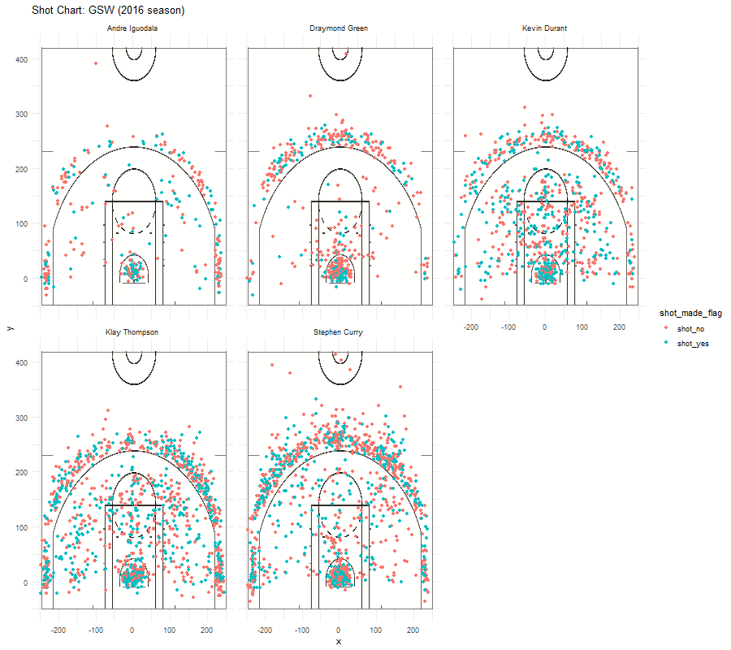

```{r intializing, include=FALSE}

#load library functions
library(readr)
library(ggplot2)
library(dplyr)

#initialize data
colTypes <- c('character', 'character', 'character', 'numeric', 'numeric', 'numeric', 'numeric', 'character', 'factor', 'factor', 'numeric', 'character', 'numeric', 'numeric', 'character', 'numeric')
#get all player data
shots_data <- read.csv("../data/shots-data.csv", stringsAsFactors = FALSE, header = TRUE, colClasses = colTypes)

effective_shooting_2pt <- filter(select(shots_data, name, shot_type, shot_made_flag), shot_type == '2PT Field Goal')
effective_shooting_2pt <- mutate(effective_shooting_2pt, made = as.integer(shot_made_flag == 'shot_yes'))
effective_shooting_2pt <- effective_shooting_2pt %>% group_by(name) %>% 
                          summarize(total = length(name), made = sum(made), perc_made = made/total) %>%
                          arrange(desc(perc_made))

effective_shooting_3pt <- filter(select(shots_data, name, shot_type, shot_made_flag), shot_type == '3PT Field Goal')
effective_shooting_3pt <- mutate(effective_shooting_3pt, made = as.integer(shot_made_flag == 'shot_yes'))
effective_shooting_3pt <- effective_shooting_3pt %>% group_by(name) %>% 
                          summarize(total = length(name), made = sum(made), perc_made = made/total) %>%
                          arrange(desc(perc_made))

effective_shooting_all <- filter(select(shots_data, name, shot_type, shot_made_flag))
effective_shooting_all <- mutate(effective_shooting_all, made = as.integer(shot_made_flag == 'shot_yes'))
effective_shooting_all <- effective_shooting_all %>% group_by(name) %>% 
                          summarize(total = length(name), made = sum(made), perc_made = made/total) %>%
                          arrange(desc(perc_made))


```

```{r echo=FALSE}
knitr::kable(as_tibble(effective_shooting_2pt), format='markdown')
knitr::kable(as_tibble(effective_shooting_3pt), format='markdown')
knitr::kable(as_tibble(effective_shooting_all), format='markdown')
```

```{r out.width='80%', echo = FALSE, fig.align='center'}
  
```
